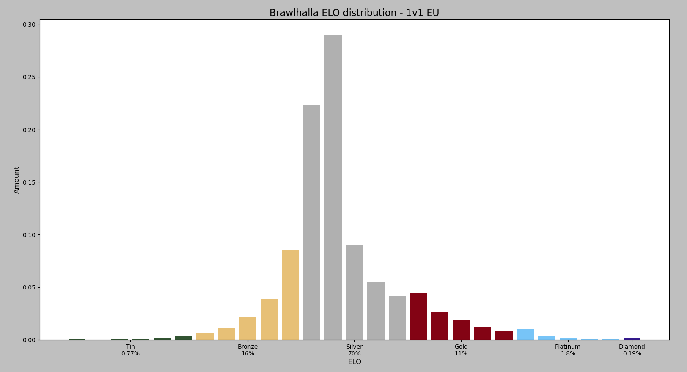
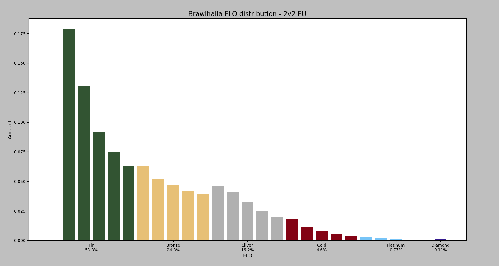

# Brawlhalla-ELO-Distribution
This is a bundle of python scripts that let you scrape the brawlhalla leaderboards and generate plots showing the current ELO distribution.

# How to Use:
1. Get a [Brawlhalla API Key](https://dev.brawlhalla.com/)
2. Clone the Repository
3. Get the current leaderboard's length using **leaderboardlength.py**
4. Scrape data from the Brawlhalla leaderboard using **scrapeleaderboard.py**
5. Generate plot using **visualize.py**

# Settings
< WIP >

## Example Plots:

