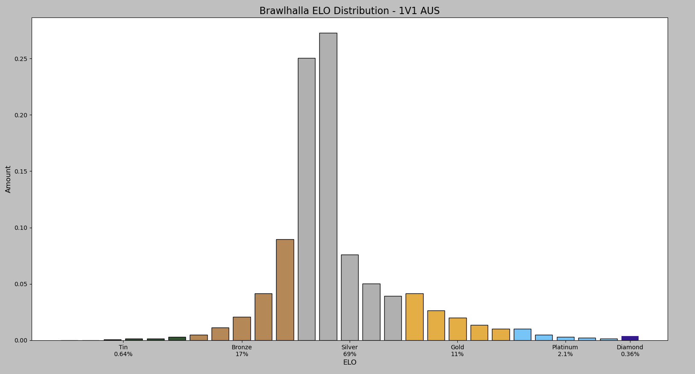
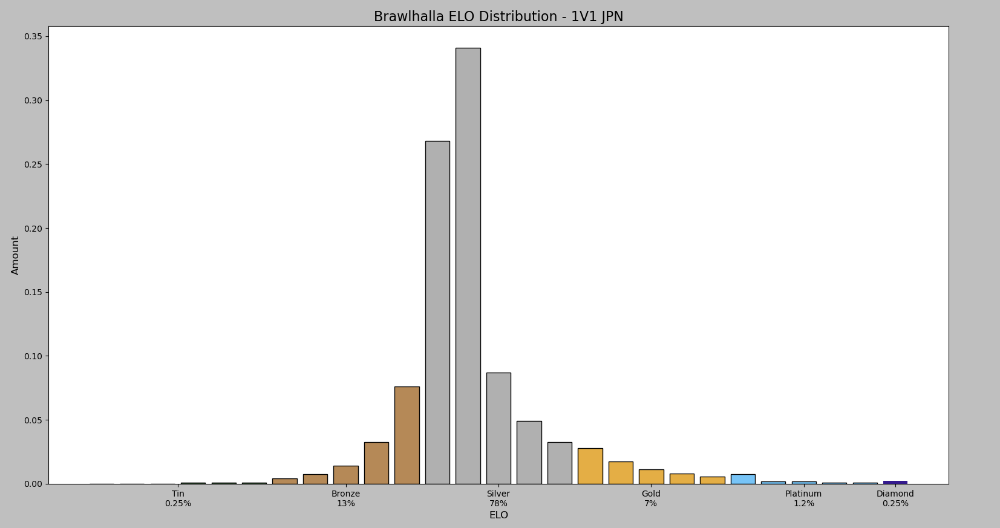

# Brawlhalla-ELO-Distribution
This is a bundle of python scripts that let you scrape the brawlhalla leaderboards and generate plots showing the current ELO distribution.

# How to Use:
1. Get a [Brawlhalla API Key](https://dev.brawlhalla.com/)
2. Clone the Repository
3. Get the current leaderboard's length using **leaderboardlength.py**
4. Scrape data from the Brawlhalla leaderboard using **scrapeleaderboard.py**
5. Generate plot using **visualize.py**

(You can also just skip Step 1-4 and use the **visualize.py** script to visualize the provided .csv files)

# Settings
< WIP >

# Collected Data (July 2020)
Them 1v1 distribution seems to be really similar for the regions, except Japan.

| 1v1      | US-E  | EU    | SEA   | BRZ   | AUS   | US-W  | JPN   |
|----------|-------|-------|-------|-------|-------|-------|-------|
| Tin      | 0.72% | 0.77% | 0.63% | 0.72% | 0.64% | 0.74% | 0.25% |
| Bronze   | 16%   | 16%   | 16%   | 17%   | 17%   | 16%   | 13%   |
| Silver   | 69%   | 70%   | 71%   | 70%   | 69%   | 70%   | 78%   |
| Gold     | 12%   | 11%   | 10%   | 11%   | 11%   | 11%   | 7%    |
| Platinum | 2%    | 1.8%  | 2.1%  | 1.8%  | 2.1%  | 1.9%  | 1.2%  |
| Diamond  | 0.23% | 0.19% | 0.29% | 0.22% | 0.36% | 0.19% | 0.25% |

## Example Plots (1v1):

